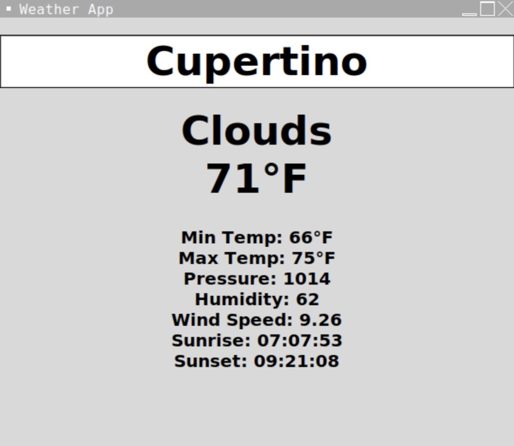

# Weather-App

This is a simple Python Weather App built using Tkinter for the GUI and the OpenWeatherMap API for fetching real-time weather data. Enter any city name, and the app will display the current weather, temperature, pressure, humidity, wind speed, and sunrise/sunset times.

## Features:

- Weather data from OpenWeatherMap using API
- Displays
  - Current weather
  - Temperature (current, min, max)
  - Atmospheric Pressure
  - Humidity
  - Wind Speed
  - Sunrise/Sunset Times
  - Clean and user-friendly GUI using Tkinter

## Preview:



## Tech Stack:

  - Python 3
  - Tkinter for GUI
  - Requests for API calls
  - OpenWeatherMap API

## Installations:

  1. Install dependencies using:
     ```bash
     pip install requests
  - Tkinter must be installed as well, but it is included in most Python 3 installations

## Setup:

  1. Clone the repository:
     ```bash
     git clone https://github.com/cookies101-cookies/weather-app.git cd weather-app

  2. API Key:
    - Replace the API key with your own from OpenWeatherMap:
      ```bash
      api = "https://api.openweathermap.org/data/2.5/weather?q=" + city + "&appid=YOUR_API_KEY"

  3. Run the app:
     ```bash
     python Weather-App.py

## Notes:

- Time zone for sunrise/sunset is adjusted manually (-21600 seconds = UTC-6). Adjust this for your own timezone if needed.
- API responses are in Kelvin, and the code converts them to Fahrenheit.
- Celsius conversion:
  1. Replace block (12-14) with this block:
     ```bash
     temp = int(json_data['main']['temp'] - 273.15)
     min_temp = int(json_data['main']['temp_min'] - 273.15)
     max_temp = int(json_data['main']['temp_max'] - 273.15)

  2. Update the units in block (21-22) to this block:
     ```bash
     final_info = condition + "\n" + str(temp) + "°C"
     final_data = "\n" + "Min Temp: " + str(min_temp) + "°C" + ...

## Contributions:

- Pull requests and suggestions are welcome! Feel free to fork and improve the project.


